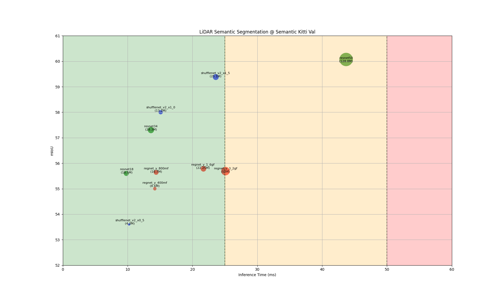

# Semantic LiDAR

A tool for training and finetuning of a semantic segmentation model on data of an Ouster OS2-128 (Rev 7), collected @ TH AB

[](https://drive.google.com/file/d/1R7l4302yjyHZzcCP7Cm9vKr7sSnPDih_/view)
## Development environment:

### VS-Code:
The project is designed to be delevoped within vs-code IDE using remote container development.

### Setup Docker Container
In docker-compse.yaml all parameters are defined.
```bash
# Enable xhost in the terminal
sudo xhost +

# Add user to environment
sh setup.sh

# Build the image from scratch using Dockerfile, can be skipped if image already exists or is loaded from docker registry
docker-compose build --no-cache

# Start the container
docker-compose up -d

# Stop the container
docker compose down
```
## Training:
### Train Semantic Kitti
Download the [SemanticKitti](http://www.semantic-kitti.org/) dataset [1].

Extract the folders to ./dataset

Ensure the following data structure:

```
├── data
│   ├── SemanticKitti
│   │   ├── dataset
│   │   │   ├── sequences
│   │   │   │   ├── 00
│   │   │   │   │   ├── velodyne
│   │   │   │   │   │   ├── *.bin
│   │   │   │   │   ├── label
│   │   │   │   │   │   ├── *.label
```

Run a single training by:
```bash
appuser@a359158587ad:~/repos$ python train_semantic_Kitti.py --model_type resnet34 --learning_rate 0.001 --num_epochs 50 --batch_size 1 --num_workers 1 --rotate --flip --visualization
```

Run all trainings by:
```bash
appuser@a359158587ad:~/repos$ chmod +x run_training_kitti.sh
appuser@a359158587ad:~/repos$ ./run_training_kitti.sh
```

### Train Semantic THAB

Ensure the following data structure:

```
├── data
│   ├── SemanticTHAB
│   │   ├── 070323 # Date
│   │   │   ├── 0001 # SequenceID
│   │   │   │   ├── velodyne
│   │   │   │   │   ├── *.bin
│   │   │   │   ├── label
│   │   │   │   │   ├── *.label

```

Run the training by:
```bash
python src/train_semantic_THAB.py --model_type resnet34 --learning_rate 0.001 --num_epochs 50 --batch_size 8 --num_workers 16 --rotate --flip --visualization
```

## Model Zoo
We provide a large collection of pre-trained models with different backbones, number of parameters, and inference times.
You can choose the model suitable for your application.

### SemanticKitti


You can download pre-trained models from our model zoo:
| Backbone | Parameters | Inference Time¹ | mIoU² | Status 
|:--------:|:----------:|:---------------:|:----:|:------:|
| [[resnet18]](https://drive.google.com/drive/folders/1blLMyAXlmSCHIvQhBRWdbkCvDqQtW4AR?usp=sharing) |  18.5 M     |  9.8 ms  | 55.6%  | $${\color{green}Online}$$ 
| [[resnet34]](https://drive.google.com/drive/folders/1mDyPiZBHOi1mDpw-tvoqWRuKqjcod6N4?usp=sharing) |  28.3 M      |  13.6ms  | 57.3%  | $${\color{green}Online}$$ 
| [[resnet50]](https://de.wikipedia.org/wiki/HTTP_404) |  128.8 M      |  43.7 ms  | 60.07%  | $${\color{red}Offline}$$
| [[regnet_y_400mf]](https://de.wikipedia.org/wiki/HTTP_404) |  8.6 M      |  14.2 ms  | 55.0%  | $${\color{red}Offline}$$
| [[regnet_y_800mf]](https://de.wikipedia.org/wiki/HTTP_404) |  16.7 M      |  14.4 ms  | 55.64%  | $${\color{red}Offline}$$
| [[regnet_y_1_6gf]](https://de.wikipedia.org/wiki/HTTP_404) |  22.25 M      |  21.7 ms  | 55.78%  | $${\color{red}Offline}$$
| [[regnet_y_3_2gf]](https://de.wikipedia.org/wiki/HTTP_404) |  52 M      |  25.1 ms  | 55.69%  | $${\color{red}Offline}$$
| [[shufflenet_v2_x0_5]](https://de.wikipedia.org/wiki/HTTP_404) |  4.3 M      |  10.24 ms  | 55.64%  | $${\color{red}Offline}$$
| [[shufflenet_v2_x1_0]](https://de.wikipedia.org/wiki/HTTP_404) |  13.2 M      |  15.1 ms  | 58.0%  | $${\color{red}Offline}$$
| [[shufflenet_v2_x1_5]](https://de.wikipedia.org/wiki/HTTP_404) |  25.1 M      |  23.6 ms  | 59.38%  | $${\color{red}Offline}$$


¹ Inference time measured as forward path time at a Nivida Geforce RTX 2070 TI with batchsize of one.

² mIoU is measured in range view representation. NaNs (from non occuring classes in SemanticKitti Val) are treated as zeros.
  IoU results are not directly comparable to the SemanticKitti benchmark! 

## Dataset
### Semantic THAB
We created our dataset using an Ouster OS2-128 (Rev 7) from sequences recorded in Aschaffenburg (Germany). 
For data annotation, we used the [Point Labeler](https://github.com/jbehley/point_labeler) from [1]. 
To be consistent with [SemanticKitti](http://www.semantic-kitti.org/) [1], we have used their class definitions.


| Date | Sequences |  Status    | Size | Meta | Split
|:----:|:---------:|:-------------:|:---------:|:------:|:------:|
| 070324    | [[0001]](https://drive.google.com/file/d/1v6ChrQ8eaOKVz2kEZmVoTz3aY2B46eN6/view?usp=sharing)    | $${\color{green}Online}$$ |  1090  | Residential Area / Industrial Area | Train
| 190324    | [[0001]](https://drive.google.com/file/d/1I69_bAd4E_1VeGDvnlf2HgxgVJnEhc3G/view?usp=sharing)    | $${\color{green}Online}$$ |  344   | City Ring Road                     | Train
| 190324    | [[0002]](https://drive.google.com/file/d/1fJ2uhToOQArDZW0wQcnDWeLQViExk7Zy/view?usp=sharing)    | $${\color{green}Online}$$ |  228   | Inner City                         | Train
| 190324    | [[0003]](https://drive.google.com/file/d/167E8YQWMhifcUOtMSgp-YpCiEAR72gJA/view?usp=sharing)    | $${\color{green}Online}$$ |  743   | Pedestrian Area                    | Train
| 190324    | [[0004]](https://de.wikipedia.org/wiki/HTTP_404)    | $${\color{red}Offline}$$  |  400   | Inner City                         | Train
| 190324    | [[0005]](https://de.wikipedia.org/wiki/HTTP_404)    | $${\color{red}Offline}$$  |  603   | Inner City                         | Test
| 190324    | [[0006]](https://de.wikipedia.org/wiki/HTTP_404)    | $${\color{red}Offline}$$  |  ??   | Inner City                          | Test
| 190324    | [[0007]](https://de.wikipedia.org/wiki/HTTP_404)    | $${\color{red}Offline}$$  |  ??   | Residential Area & Campus TH AB     | Test
| 190324    | [[0008]](https://de.wikipedia.org/wiki/HTTP_404)    | $${\color{red}Offline}$$  |  ??   | Campus TH AB                        | Train


## Inference:
You can explore /src/inference_ouster.py for an example how to use our method with a data stream from an Ouster OS2-128 sensor.
We provide a sample sensor recording.

### References
[1]   J. Behley et al., "SemanticKITTI: A Dataset for Semantic Scene Understanding of LiDAR Sequences," 2019 IEEE/CVF International Conference on Computer Vision (ICCV), Seoul, Korea (South), 2019, pp. 9296-9306, doi: 10.1109/ICCV.2019.00939.


