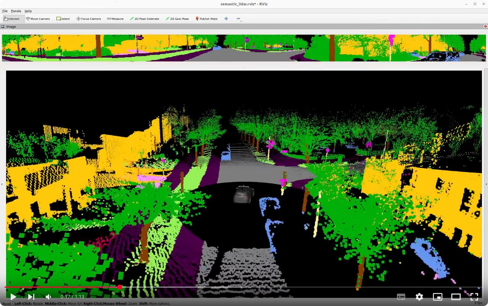

# Semantic LiDAR

A tool for training and finetuning of a semantic segmentation model on data of an Ouster OS2-128 (Rev 7), collected @ TH AB
[](https://www.youtube.com/watch?v=d7v6hlMiOuw)

## Datasets
See [README.md](dataset/README.md) to learn about the data preperation.

### SemanticKitti 
The SemanticKITTI dataset is a large-scale dataset designed for semantic segmentation in autonomous driving. It contains 22,000+ 3D LiDAR point clouds collected from urban environments. The dataset includes labeled point clouds with 28 semantic classes, such as road, car, pedestrian, and building. It provides ground truth annotations for training and evaluating semantic segmentation algorithms, offering a real-world benchmark for 3D scene understanding in self-driving car applications. The dataset is widely used for developing and testing models that handle point cloud data and scene interpretation in dynamic environments.

### SemanticTHAB [](https://doi.org/10.5281/zenodo.14677779)
The SemanticTHAB dataset can be seen as an extention of the SemanticKITTI dataset for modern and high resoltion 3D LiDAR sensors. It contains 4,000+ 3D LiDAR point clouds collected from urban environments. It shares the label definition with SemanticKITTI.

Download the SemanticTHAB dataset from [https://zenodo.org/records/14677644](https://zenodo.org/records/14677779)

Subject to technical modifications; no responsibility is accepted for the accuracy of this information. Make sure you use the newest version!

## Development environment:
### Reference System
```bash
OS: Ubuntu 22.04.4 LTS x86_64 
Host: B550 AORUS ELITE 
Kernel: 6.8.0-49-generic 
CPU: AMD Ryzen 9 3900X (24) @ 3.800G 
GPU: NVIDIA GeForce RTX 3090 
Memory: 32031MiB                      
```

### VS-Code:
The project is designed to be delevoped within vs-code IDE using remote container development.

### Setup Docker Container
In docker-compse.yaml all parameters are defined.
```bash
# Enable xhost in the terminal
sudo xhost +

# Add user to environment
sh setup.sh

# Build the image from scratch using Dockerfile, can be skipped if image already exists or is loaded from docker registry
docker compose build --no-cache

# Start the container
docker compose up -d

# Stop the container
docker compose down
```
> [!CAUTION]
> xhost + is not a save operation!
## Training:
### Train Semantic Kitti

Run a single training by:
```bash
appuser@a359158587ad:~/repos$ python train_semantic_Kitti.py --model_type resnet34 --learning_rate 0.001 --num_epochs 50 --batch_size 1 --num_workers 1 --rotate --flip --visualization
```

Run all trainings by:
```bash
appuser@a359158587ad:~/repos$ chmod +x run_training_kitti.sh
appuser@a359158587ad:~/repos$ ./run_training_kitti.sh
```
This will create the following results structure:
```
dataset
└───train_semantic_KITTI
│   └───{backbone}_{model_configuration}
│   |   │   config.json # configuration file
│   |   │   events.out.tfevents.* # tensorflow events
│   |   │   model_final.pth # network weights
│   |   │   results.json # class IoU and mIoU for the eval set
```

### Train Semantic THAB

Run the training by:
```bash
python repos/train_semantic_THAB.py --model_type resnet34 --learning_rate 0.001 --num_epochs 50 --batch_size 8 --num_workers 16 --rotate --flip --visualization
```
This will create the following results structure:
```
dataset
└───train_semantic_THAB
│   └───{backbone}_{model_configuration}
│   |   │   config.json # configuration file
│   |   │   events.out.tfevents.* # tensorflow events
│   |   │   model_final.pth # network weights
│   |   │   results.json # class IoU and mIoU for the eval set
```

Run all trainings including cross validation by:
```bash
appuser@a359158587ad:~/repos$ chmod +x run_training_THAB.sh
appuser@a359158587ad:~/repos$ ./run_training_THAB.sh
```


## Inference:
You can explore /src/inference_ouster.py for an example how to use our method with a data stream from an Ouster OS2-128 sensor.

## ROS Demonstation System
To explore a ROS2 demonstration of our system check out the following repo:
[https://github.com/kav-institute/Semantic_LiDAR_ROS](https://github.com/kav-institute/Semantic_LiDAR_ROS)


<a name="license"></a>
## License:
This project is licensed under the Apache 2.0 License - see the [LICENSE](LICENSE) file for details. Note that the dataset is provided by a different licence!

### References
[1]   J. Behley et al., "SemanticKITTI: A Dataset for Semantic Scene Understanding of LiDAR Sequences," 2019 IEEE/CVF International Conference on Computer Vision (ICCV), Seoul, Korea (South), 2019, pp. 9296-9306, doi: 10.1109/ICCV.2019.00939.


